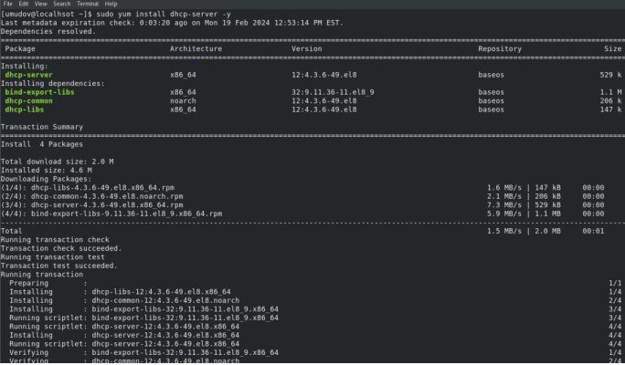
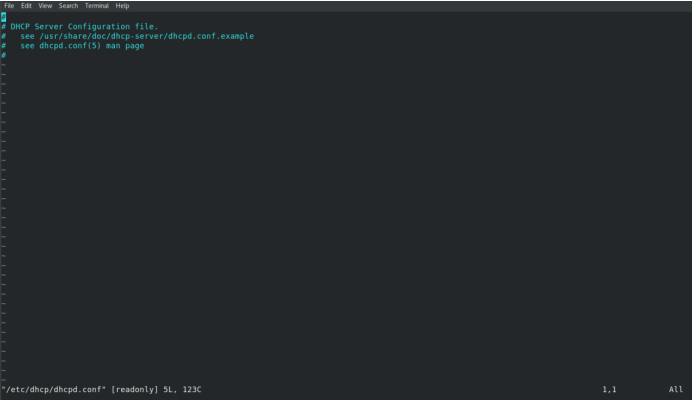
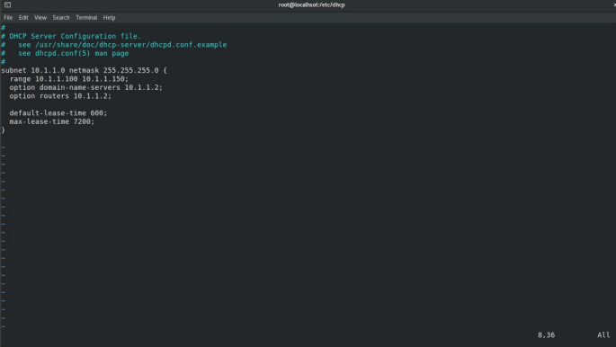
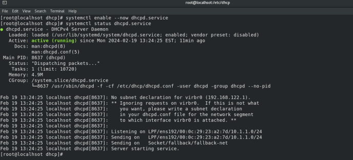
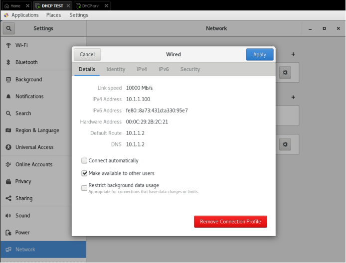

# 🖧 DHCP Server Setup on Linux (RHEL/CentOS)
> A step-by-step guide to installing and configuring a DHCP server on Linux using `dhcp-server`.

---

##  Table of Contents
- [What is DHCP?](#what-is-dhcp)
- [Prerequisites](#prerequisites)
- [Installation](#installation)
- [Configuration](#configuration)
- [Starting the Service](#starting-the-service)
- [Verification](#verification)
- [File Structure](#file-structure)

---

##  What is DHCP?
**DHCP (Dynamic Host Configuration Protocol)** is a network protocol used to automatically assign IP addresses and other network configuration parameters to devices on a network.

Without DHCP, every device on a network would need to be manually configured with an IP address. DHCP automates this process, making network management easier and more scalable.

---

## Prerequisites
- A machine running RHEL / CentOS / Rocky Linux / AlmaLinux
- Root or sudo access
- Basic knowledge of Linux terminal

---

##  Installation
Open the terminal and run the following command to install the DHCP server package:

```bash
sudo yum install dhcp-server -y
```

This will install the following packages:
- `dhcp-server`
- `dhcp-libs`
- `dhcp-common`
- `bind-export-libs`



---

##  Configuration
The main configuration file is located at:

```
/etc/dhcp/dhcpd.conf
```

Open it with a text editor:

```bash
vim /etc/dhcp/dhcpd.conf
```

> **Note:** By default, the file is empty (only contains comments).



Add your subnet configuration in Insert mode (`i`):

```conf
subnet 10.1.1.0 netmask 255.255.255.0 {
    range 10.1.1.100 10.1.1.150;
    option domain-name-servers 10.1.1.2;
    option routers 10.1.1.2;

    default-lease-time 600;
    max-lease-time 7200;
}
```



### Configuration Explained
| Directive | Description |
|-----------|-------------|
| `subnet` | The network address of your subnet |
| `netmask` | The subnet mask |
| `range` | The pool of IP addresses to assign to clients |
| `option domain-name-servers` | DNS server IP address |
| `option routers` | Default gateway (router) IP address |
| `default-lease-time` | Default lease duration in seconds (600 = 10 min) |
| `max-lease-time` | Maximum lease duration in seconds (7200 = 2 hours) |

The full config file is available here: [`configs/dhcpd.conf`](configs/dhcpd.conf)

---

##  Starting the Service
After saving the configuration file, enable and start the DHCP service:

```bash
systemctl enable --now dhcpd.service
systemctl status dhcpd.service
```



---

##  Verification
Check a client machine's network settings to confirm it received an IP from the DHCP server.

The client should show:
- An IP address within the configured `range` (e.g., `10.1.1.100`)
- The correct `Default Route` (gateway)
- The correct `DNS` server



You can also check active leases on the server:

```bash
cat /var/lib/dhcpd/dhcpd.leases
```

---

## File Structure

```
linux-dhcp-server-setup/
│
├── README.md               # This guide
├── configs/
│   └── dhcpd.conf          # Sample DHCP configuration file
└── screenshots/
    ├── 01-installation.png
    ├── 02-dhcpd-conf-empty.png
    ├── 03-dhcpd-conf-configured.png
    ├── 04-service-status.png
    └── 05-client-ip.png
```

---

##  Notes
- This guide covers **IPv4** only. For IPv6, configure `dhcpd6.conf` instead.
- Firewall rules may need to be updated to allow DHCP traffic (UDP ports 67 and 68).

```bash
firewall-cmd --add-service=dhcp --permanent
firewall-cmd --reload
```

---

## License
This project is open source and available under the [MIT License](LICENSE).
